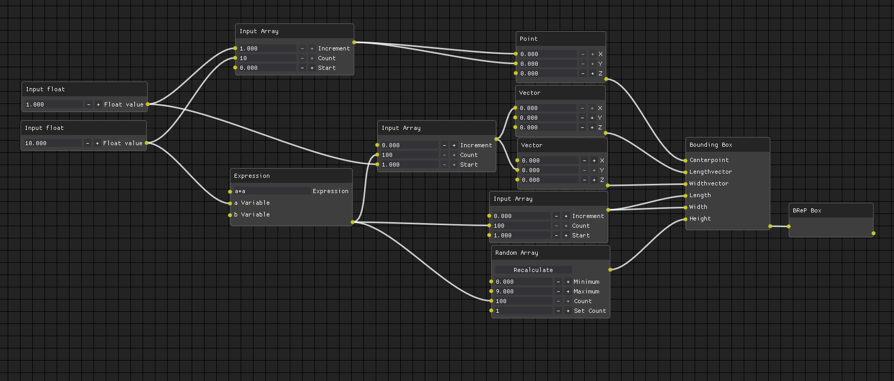

Gradient is a node based editor for use with Autodesk Fusion 360. I started working on Gradient because I wanted a tool for myself and others to make useful, fun, interesting and weird 3D models with. 3D models that are not easily made with the Fusion 360's vanilla design tools.

Gradients intent is to allow you to make algorithemically defined geometry that would be tricky to make with the standard Fusion parametric or direct design tools. Gradient will also provide a quicker and more designer friendly way to leverage the Fusion 360 API. The intent behind this is to allow for others to extend the CAD systems capabilities by making analysis tools, CAM tools and anything else you may need without the difficulties of coding a full addin.

🚧Warning!🚧

Gradient is currently in a very early state. What that means is that a tiny fraction of the functionality has been implemented and there will be some bugs and general jankyness.